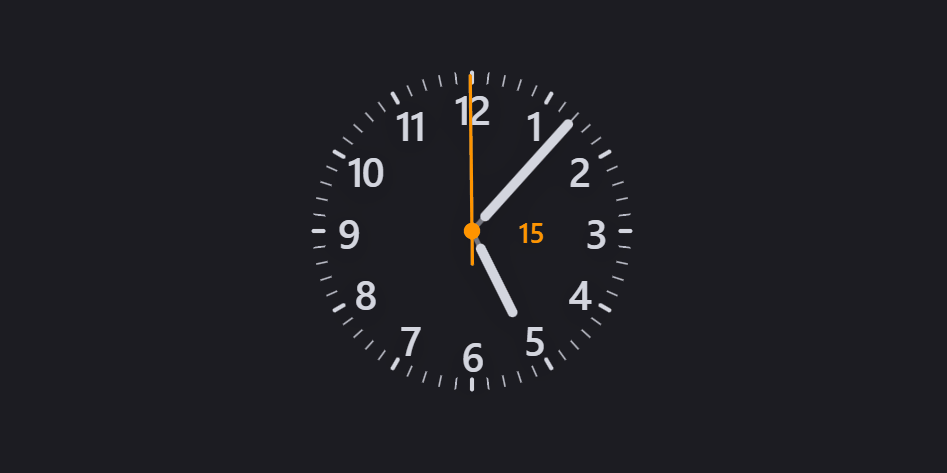
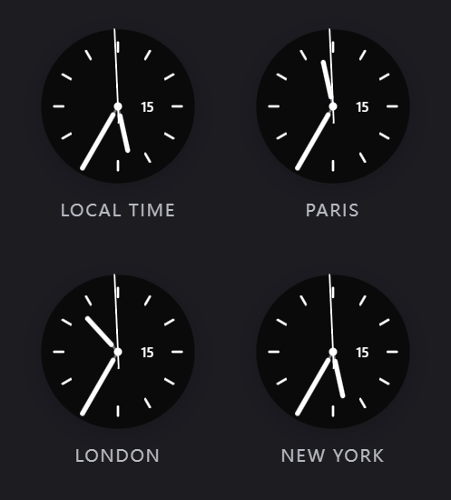
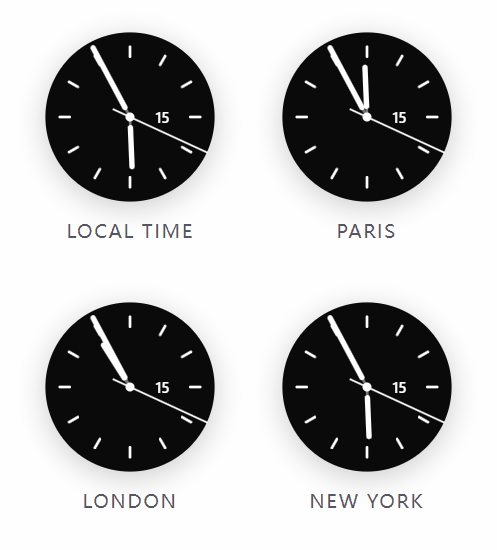

  <strong>English</strong> | <a href="./README_zh.md">简体中文</a>

# Meridian for Obsidian

Meridian is a clock plugin for Obsidian. It provides customizable analog and digital clocks that you can place in your sidebar to keep track of your local time or other timezones around the world.

  <table>
    <tr>
      <td align="center"><strong>🌙 Dark Mode</strong></td>
      <td align="center"><strong>☀️ Light Mode</strong></td>
    </tr>
    <tr>
      <td></td>
      <td></td>
    </tr>
  </table>

## Features

- **Analog and Digital Faces:** Choose between a traditional analog mechanical clock or a text-based digital clock.
- **World Clock (2x2 Grid):** Display up to four different clocks in a single pane to track multiple timezones.
- **Timezones & Custom Cities:** The plugin includes a built-in list of major global cities. You can also add your own custom cities by selecting a standard IANA timezone (e.g., `America/New_York` or `Europe/London`), which automatically handles Daylight Saving Time (DST) changes.
- **Appearance Settings:** 
  - Change the analog dial layout (standard ticks, dense ticks, numbers, dots, etc.).
  - Customize the colors for the background, clock hands, ticks, and text.
  - Select different typography and layouts for the digital clock.
  - Adjust the second hand movement (sweep, tick, or hidden).
- **Presets:** The plugin comes with several built-in themes. You can also save your current appearance settings to your own collection for easy switching later.

  <table>
    <tr>
      <td align="center"><strong>🌙 Dark Mode</strong></td>
      <td align="center"><strong>☀️ Light Mode</strong></td>
    </tr>
    <tr>
      <td></td>
      <td></td>
    </tr>
  </table>

## How to use

1. Open the Command Palette (`Ctrl/Cmd + P`).
2. Search for and execute **`Open Meridian Clock`**.
3. The clock will open in a new pane. You can drag and drop this tab to your left or right sidebar.
4. Go to `Settings > Meridian` to configure the appearance, timezones, and manage presets.

## Installation

**From Obsidian Community Plugins:**
1. Open Obsidian `Settings` > `Community Plugins`.
2. Disable "Safe Mode" if prompted.
3. Click `Browse` and search for **Meridian Clock**.
4. Install and enable the plugin.

**Manual Installation:**
1. Download `main.js`, `styles.css`, and `manifest.json` from the [Releases page](https://github.com/MorpheusXu/meridian-clock/releases).
2. Create a folder named `meridian-clock` inside your vault's `.obsidian/plugins/` directory.
3. Place the downloaded files into this folder.
4. Reload Obsidian and enable the plugin in your Community Plugins settings.

## Feedback and Issues
If you find a bug, have an idea for a new feature, or want to contribute, please open an issue on [GitHub](https://github.com/MorpheusXu/meridian-clock/issues).